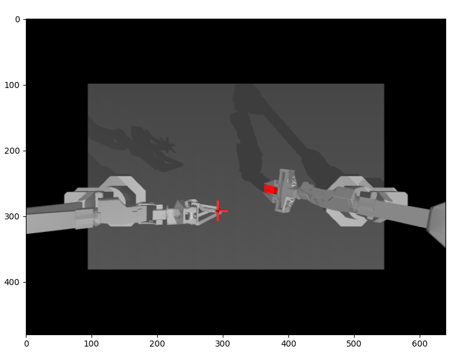
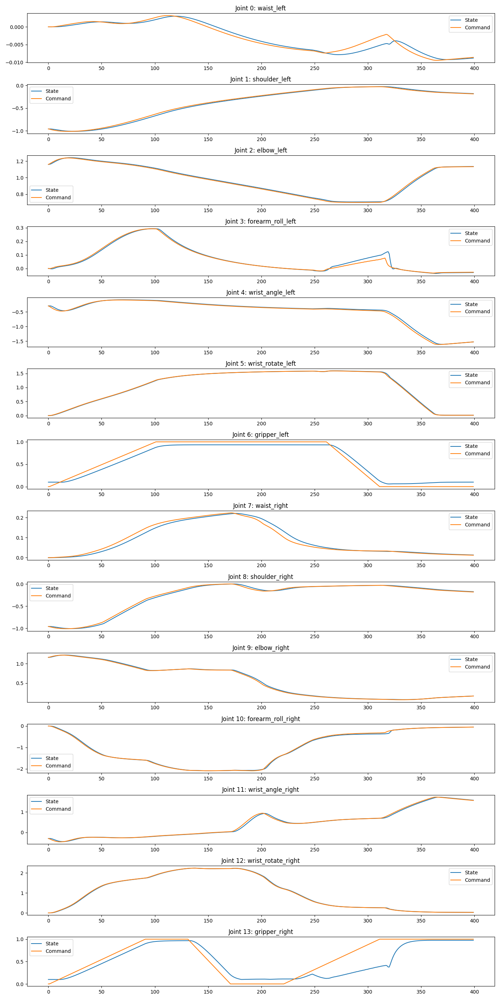
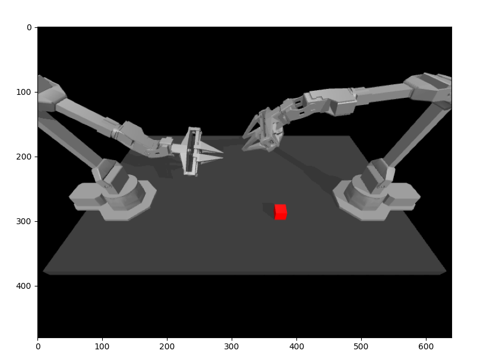

# Mobile ALOHA

A Low-cost Open-source Hardware System for Bimanual Teleoperation

首先感谢`Fu, Zipeng and Zhao, Tony Z. and Finn, Chelsea`作者们伟大的开源工作[Mobile ALOHA](https://github.com/MarkFzp/mobile-aloha?tab=readme-ov-file)。

松灵机器人作为AI机器人公司引领者之一，是一家领先的移动机器人底盘制造商和无人系统解决方案提供商，其自主研发多模态轮式和履带式线控底盘技术和机器人系统解决方案，为各领域提供了定制化的机器人应用方案。秉承开源精神，后续更新Mobile ALOHA相关进展。

松灵机器人[中文官网](https://www.agilex.ai/) ; [office website](https://global.agilex.ai/)

# ACT

# 1 简介
涉及到了这三大关键技术：ACT、Diffusion Policy、VINN

1. 端到端的模仿学习
2. 基于Transformer在动作序列上生成模型，动作分块算法。

+ 解决现有机器人昂贵且难以做精确任务的问题
+ 可以通过定制远程操作接口收集实际演示，进行端到端的模仿学习

# 2. ENV

本机配置：ubuntu20.04，cuda-11.3

## 2.1 环境配置
~~~python
# 1. 创建python虚拟环境
conda create -n aloha python=3.8

# 2. 激活虚拟环境
conda activate aloha

# 3. 安装适合cuda的torch
pip install torch==1.11.0+cu113 torchvision==0.12.0+cu113 torchaudio==0.11.0 --extra-index-url https://download.pytorch.org/whl/cu113

# 4 安装detr
##  拉取act源码
git clone https://github.com/agilexrobotics/act-plus-plus.git
cd act-plus-plus

# 4.1 其他依赖
pip install -r requirements.txt

## 4.2 安装detr
cd detr && pip install -v -e .
~~~

## 2.2 simulated environments datasets
You can find all scripted/human demo for simulated environments here. [here](https://drive.google.com/drive/folders/1gPR03v05S1xiInoVJn7G7VJ9pDCnxq9O)

下载后, 拷贝到`act-plus-plus/data`目录下，目录结构如下：

~~~python
act-plus-plus/data
    ├── sim_insertion_human
    │   ├── sim_insertion_human-20240110T054847Z-001.zip
        ├── ...
    ├── sim_insertion_scripted
    │   ├── sim_insertion_scripted-20240110T054854Z-001.zip
        ├── ... 
    ├── sim_transfer_cube_human
    │   ├── sim_transfer_cube_human-20240110T054900Z-001.zip
    │   ├── ...
    └── sim_transfer_cube_scripted
        ├── sim_transfer_cube_scripted-20240110T054901Z-001.zip
        ├── ...
~~~

## 2.3 fix error when run
~~~python
# 1 错误1
ModuleNotFoundError: No module named 'robomimic.algo.diffusion_policy'
# 原因：robomimic的release版本还不支持diffusion_policy模块。下载,离线安装diffusion-policy-mg分支即可
git clone https://github.com/ARISE-Initiative/robomimic.git -b diffusion-policy-mg
cd robomimic && pip install -v -e .

# 2 错误2
Data from: ['/scr/tonyzhao/datasets/sim_transfer_cube_scripted']
...
 File "/home/lin/aloha/act-plus-plus/utils.py", line 245, in load_data
    _, all_episode_len = get_norm_stats(dataset_path_list)
  File "/home/lin/aloha/act-plus-plus/utils.py", line 174, in get_norm_stats
    all_qpos_data = torch.cat(all_qpos_data, dim=0)
NotImplementedError: There were no tensor arguments to this function (e.g
...
修改constants.py的第5行左右DATA_DIR变量的值, 设置为自己下载的路径即可，如下：
# DATA_DIR = '/home/lin/aloha/act-plus-plus/data' if os.getlogin() == 'zfu' else '/scr/tonyzhao/datasets'
DATA_DIR = '/home/lin/aloha/act-plus-plus/data'

# 3 错误3：
TypeError: forward() got an unexpected keyword argument 'pos'
修改：
in detr/models/detr_vae.py at line 285 change build_transformer to build_encoder
~~~

---

运行代码时，报错请参考2.3小节

# 3 generate episodes

~~~python
# 1 运行
python3 record_sim_episodes.py --task_name sim_transfer_cube_scripted --dataset_dir <data save dir> --num_episodes 50
# --dataset_dir 保存路径

# 2 以sim_transfer_cube_scripted为样例,运行
python3 record_sim_episodes.py --task_name sim_transfer_cube_scripted --dataset_dir data/sim_transfer_cube_scripted --num_episodes 10

# 2.1 实时渲染
python3 record_sim_episodes.py --task_name sim_transfer_cube_scripted --dataset_dir data/sim_transfer_cube_scripted --num_episodes 10  --onscreen_render

# 2.2 运行后终端打印如下
ube_scripted --num_episodes 10
episode_idx=0
Rollout out EE space scripted policy
episode_idx=0 Failed
Replaying joint commands
episode_idx=0 Failed
Saving: 0.9 secs

episode_idx=1
Rollout out EE space scripted policy
episode_idx=1 Successful, episode_return=57
Replaying joint commands
episode_idx=1 Successful, episode_return=59
Saving: 0.6 secs
...
Saved to data/sim_transfer_cube_scripted
Success: 2 / 10
~~~

onscreen_render

  

终端显示episodes10个, 成功2个, 文件目录如下：
~~~python
act-plus-plus
└── sim_transfer_cube_scripted
    ├── episode_0.hdf5
    ├── episode_1.hdf5
    ├── episode_2.hdf5
    ├── episode_3.hdf5
    ├── episode_4.hdf5
    ├── episode_5.hdf5
    ├── episode_6.hdf5
    ├── episode_7.hdf5
    ├── episode_8.hdf5
    └── episode_9.hdf5
~~~

# 4  visualize episodes
~~~python
python3 visualize_episodes.py --dataset_dir <data save dir> --episode_idx 0

python3 visualize_episodes.py --dataset_dir data/sim_transfer_cube_scripted --episode_idx 9
# --episode_idx 场景索引号
# 终端打印
# Saved video to: data/sim_transfer_cube_scripted/episode_0_video.mp4
# Saved qpos plot to: data/sim_transfer_cube_scripted/episode_0_qpos.png
~~~

episode-video

  

episode-qpos

  

# 5 train

必须下载simulated environments datasets，参考2小节

~~~python
python3 imitate_episodes.py --task_name sim_transfer_cube_scripted --ckpt_dir <ckpt dir> --policy_class ACT --kl_weight 10 --chunk_size 100 --hidden_dim 512 --batch_size 8 --dim_feedforward 3200 --num_epochs 2000  --lr 1e-5 --seed 0

# 使用
python3 imitate_episodes.py --task_name sim_transfer_cube_scripted --ckpt_dir trainings --policy_class ACT --kl_weight 1 --chunk_size 10 --hidden_dim 512 --batch_size 1 --dim_feedforward 3200  --lr 1e-5 --seed 0 --num_steps 2000
# 训练时会提示下面内容，由于没有W&B account，直接选择3
wandb: (1) Create a W&B account
wandb: (2) Use an existing W&B account
wandb: (3) Don't visualize my results
wandb: Enter your choice:
~~~

训练完成后，权重会保存到`trainings`目录结果如下：

~~~
trainings
  ├── config.pkl
  ├── dataset_stats.pkl
  ├── policy_best.ckpt
  ├── policy_last.ckpt
  └── policy_step_0_seed_0.ckpt
~~~

# 5 evaluate

~~~python
# 1 evaluate the policy  加上--onscreen_render实时渲染参数
python3 imitate_episodes.py --eval --task_name sim_transfer_cube_scripted --ckpt_dir trainings --policy_class ACT --kl_weight 1 --chunk_size 10 --hidden_dim 512 --batch_size 1 --dim_feedforward 3200  --lr 1e-5 --seed 0 --num_steps 20 --onscreen_render
~~~

episode-qpos

  

---

+ 松灵机器人[中文官网](https://www.agilex.ai/) ; [office website](https://global.agilex.ai/)
+ 如需硬件平台可联系松灵客服-17796377363.
